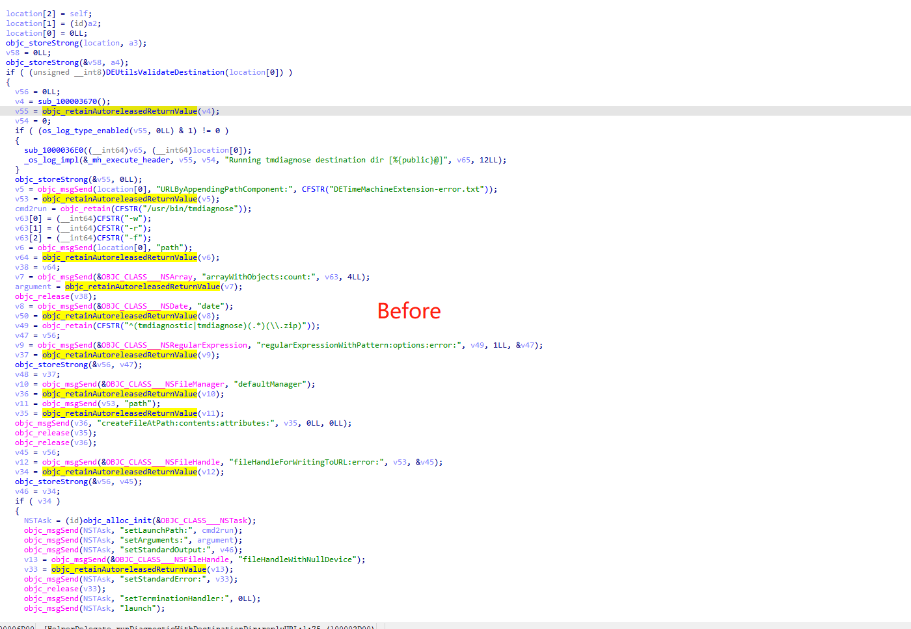
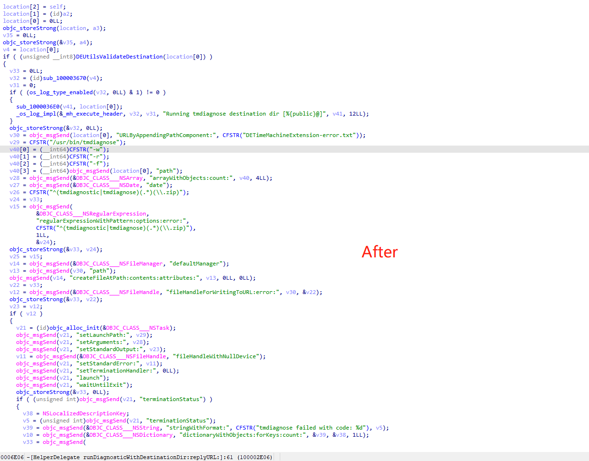

# ObjectiveC Runtime Cleaner

An IDA script that cleans up annoying and meaningless Objective-C runtime API. Current version of script cleans up [_objc_retainAutoreleasedReturnValue, _objc_retainAutoreleaseReturnValue, _objc_retain, _objc_release].

The script is based on IDApython microcode API, thus it requires IDA Pro 7.3+.

## Usage

File-> script file -> select "objcrt_cleaner.py" OR copy the content of "objcrt_cleaner.py" into the IDApython console and press Enter.

Then you can enjoy your cleaner decompiled code.

## Demo

